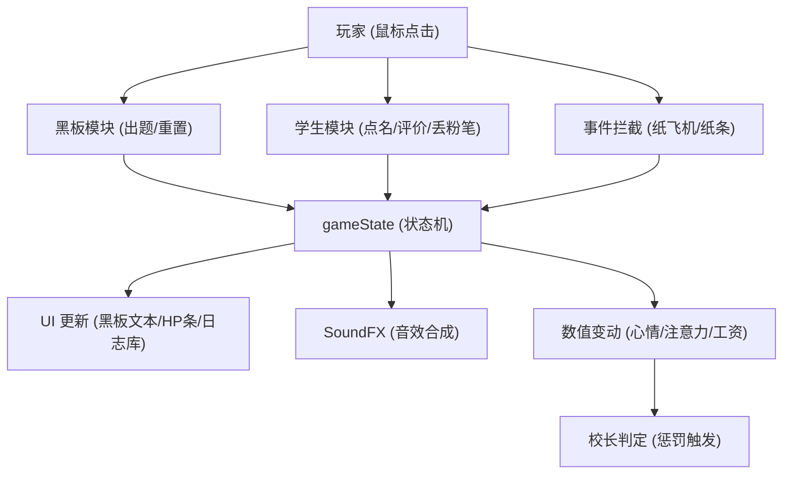

# 《我的课堂》项目系统审计报告 (Master.md)

本报告对《我的课堂》(My Class) 模拟教学游戏进行了全面的代码审计与系统化总结，旨在解析其技术架构、核心实现及交互逻辑。

---

## 一、 项目代码框架 (Project Architecture)

项目采用纯原生技术栈 (Vanilla Stack) 开发，实现了高度动态的课堂模拟体验：
- **前端核心**：HTML5 + CSS3 + JavaScript (ES6+)。
- **渲染模式**：DOM 驱动的组件化渲染，利用 CSS Grid/Flex 分层布局。
- **音效系统**：基于 **Web Audio API** 的原生合成器，不依赖任何外部音频文件。
- **状态管理**：集中式 `gameState` 对象，驱动响应式 UI 更新。

---

## 二、 核心逻辑与实现 (Core Logic)

### 1. 人格化学生模型 (Student Personality Model)
每个学生拥有独特的属性数组，这些属性动态决定其 AI 行为：
- `accuracy` (正确率)：决定答题对错概率。
- `naughty` (淘气值)：决定课堂搞小动作（纸飞机/纸条）及课间打闹的频率。
- `attention` (注意力)：显著影响举手概率；过低会进入"打瞌睡"状态。
- `mood` (心情值)：反馈机制的核心，影响整体表现。

### 2. 动态数学题库 (Dynamic Math System)
支持三年级水平的多维度出题：
- **四则运算**：加减法（含进退位）、乘除法（含表内与整除）。
- **知识点**：单位换算（时间/质量/长度）、简单估算。
- **应用题**：带有 A/B/C 选项的逻辑题，通过字符串匹配判定。

### 3. 多分支判定系统 (Judgment Logic)
游戏不仅判定答案的正误，还判定老师（玩家）的指令对错，共有四种结局：
- **双重正确**：心情、正确率双升，触发爱心特效。
- **正向纠错**：指出错误，注意力提升。
- **误导全班**：学生错但老师判对，触发校长惩罚（扣工资），全班正确率下降。
- **打击信心**：学生对但老师判错，心情暴跌，全班正确率下降。

### 4. 回答正确概率计算公式 (Answer Correctness Formula)
学生回答正确答案的概率计算公式：
```
正确概率 = 正确率 × 70% - 淘气值 × 20% + 注意力 × 20% + 心情值 × 20%
```
- 计算结果上限为 **90%**
- 权重分配：正确率(正向70%)、淘气值(负向20%)、注意力(正向20%)、心情值(正向20%)

---

## 三、 玩法机制 (Gameplay Mechanism)

### 1. 课堂时间 (Class Session)
- **核心流程**：点击黑板出题 -> 粉笔逐字动画 -> 学生概率举手 -> 玩家点名 -> 评判结算。
- **随机博弈**：玩家需在高频的捣乱事件（纸飞机、传纸条）中通过"拦截"来维持课堂秩序。
- **惩罚机制**：工资即血条。判定严重错误或未能及时制止乱象将触发"校长突击检查"，导致工资（HP）下降。

### 2. 课间模式 (Break Time)
- **自治系统**：学生从固定座位转变为基于 `requestAnimationFrame` 的物理边界漫游。
- **随机事件**：包含黑板涂鸦、摔倒大哭、分享零食、吵架推搡等，需要玩家通过"点击交互"或"选择决策"来处理。
- **恢复机制**：课间休息结束后，学生注意力+15，心情+10。

---

## 四、 动画设计与实现 (Animation Design)

### 1. 物理弹道动画
使用 **Web Animations API** (`element.animate`) 实现：
- **粉笔头**：非线性抛物线，中途缩放模拟真实飞行感。
- **纸飞机**：带有弧度和旋转的复杂弹道。

### 2. 视觉反馈
- **粒子特效**：基于 CSS Keyframes 的爱心喷涌、粉红噪声震动。
- **状态动画**：打瞌睡的 `Zzz` 文字漂移、语音气泡的渐入渐出。
- **UI 动效**：黑板逐字写入效果（Chalk Writing）、HP 条的动态色彩平滑过渡。

---

## 五、 操作逻辑与模块关系 (Logic Map)



---

## 六、 审计结论

项目通过精简的代码实现了极高的交互密度：
1. **轻量化**：完全自包含，零外部资源依赖（音频、库）。
2. **逻辑严密**：判定分级与数值连锁反应增加了游戏的策略深度。
3. **表现力强**：通过原生 API 模拟了丰富的物理与动态交互效果。

**建议方向**：未来可考虑引入"课程表"系统或"期末考试"长线目标，进一步提升重玩价值。

---

## 七、 开发迭代与需求跟踪 (Development Log)

本章节记录了开发过程中由用户（开发者）发起的关键指令及 Bug 反馈的执行情况。

### 1. UI 深度优化需求
| 需求描述 | 执行状态 | 备注 |
| :--- | :---: | :--- |
| **黑板高度翻倍** | ✅ 已完成 | 增加了黑板 `min-height` 并优化了布局比例 |
| **移除讲台区域** | ✅ 已完成 | 移除了 `.podium-area` 结构，扩展了活动空间 |
| **底部工资栏转事件日志** | ✅ 已完成 | 实现了基于时间戳的滚动日志流系统 |
| **老师头顶 HP 血条** | ✅ 已完成 | 将工资数值具象化为动态变化的血条 UI |
| **评判面板去模糊** | ✅ 已完成 | 移除了背景 `backdrop-filter`，方便评卷校对 |
| **信息分流显示** | ✅ 已完成 | 黑板仅保留题目，判定与事件信息重定向至日志 |
| **答错循环优化** | ✅ 已完成 | 学生答错后保留题目并重新触发全班举手，直至答对 |
| **老师UI放大1.5倍** | ✅ 已完成 | 老师图片尺寸调整为 210×263px |
| **学生UI放大1.3倍** | ✅ 已完成 | 学生图片尺寸调整为 156×192px |
| **血条优化** | ✅ 已完成 | 移至粉笔槽下方、纯数字显示、20格游戏风格血条 |
| **学生左右间隔加大** | ✅ 已完成 | 学生间距调整为 55px |
| **底部通知栏加高** | ✅ 已完成 | 高度调整为 100px，可显示3条以上通知 |
| **学生位置整体上移** | ✅ 已完成 | 调整 margin-top 和教师区域间距 |
| **两排学生间距减小** | ✅ 已完成 | 间距调整为 1px |
| **学生名字叠放图片下方** | ✅ 已完成 | 名字添加渐变背景，叠放在图片底部区域 |
| **教室环境光影优化** | ✅ 已完成 | 墙壁/地板/黑板添加光影效果，增强空间感 |
| **响应式布局优化** | ✅ 已完成 | 桌面端大屏/小屏/移动端竖屏/横屏四档适配 |

### 2. BUG 反馈与修复记录
| BUG 描述 | 修复状态 | 解决方案总结 |
| :--- | :---: | :--- |
| **HP 条只有文字无 UI** | ✅ 已修复 | 补全了 [style.css](file:///d:/MyClass/style.css) 中缺失的 `.hp-track` 和 `.hp-fill` 样式 |
| **纸飞机数值动画丢失** | ✅ 已修复 | 恢复了 [triggerPaperAirplane](file:///d:/MyClass/game.js) 中被意外删除的全员数值循环逻辑 |
| **黑板重复提示 (请点击...)** | ✅ 已修复 | 优化了 [updateChalkboard](file:///d:/MyClass/game.js) 的过滤逻辑与状态锁 |
| **答对后黑板不自动清空** | ✅ 已修复 | 修正了 [handleJudgment](file:///d:/MyClass/game.js) 的 `setTimeout` 闭合及状态重置逻辑 |
| **SoundFX.pa() 重复定义** | ✅ 已修复 | 移除了第一个定义，保留粉红噪声版本 |
| **小芳缺少 data-id 属性** | ✅ 已修复 | 为小芳添加 `data-id="xf"` 属性 |
| **课间时长注释与实际不符** | ✅ 已修复 | 常量 BREAK_DURATION_MS 更新为 30000 |
| **第二题后点击学生无反应** | ✅ 已修复 | 修正了 `.student-img img.active` 的 `pointer-events` 属性 |
| **第二排学生显示不全** | ✅ 已修复 | 调整学生区域布局和教师区域间距 |
| **悬浮窗无法正常消失** | ✅ 已修复 | 移除 `hideTooltip()` 中的 `setTimeout` 延迟 |
| **校长惩罚后无法继续答题** | ✅ 已修复 | 修正了校长动画 CSS 的 `visibility` 属性和 JS 清理逻辑 |
| **学生答对老师错判卡住** | ✅ 已修复 | 修正了校长惩罚特效中引用不存在元素的问题 |

### 3. 功能增强记录
| 功能描述 | 执行状态 | 实现细节 |
| :--- | :---: | :--- |
| **课间休息恢复机制** | ✅ 已完成 | 课间结束后学生注意力+15，心情+10，并推送日志通知 |
| **回答正确概率公式** | ✅ 已完成 | 实现综合概率计算：(正确率×70% - 淘气值×20% + 注意力×20% + 心情×20%)，上限90% |

---

## 八、 文件结构说明

```
d:\MyClass\
├── index.html          # 主页面结构
├── style.css           # 全局样式与动画
├── game.js             # 核心游戏逻辑
├── Master.md           # 项目审计报告（本文件）
└── assets/
    └── characters/     # 角色图片资源
        ├── teacher_standing.png
        ├── xm_*.png    # 小明
        ├── xh_*.png    # 小红
        ├── xf_*.png    # 小芳
        ├── xg_*.png    # 小刚
        ├── xl_*.png    # 小丽
        └── xq_*.png    # 小强
```

---
*报告更新于：2026-03-12*
