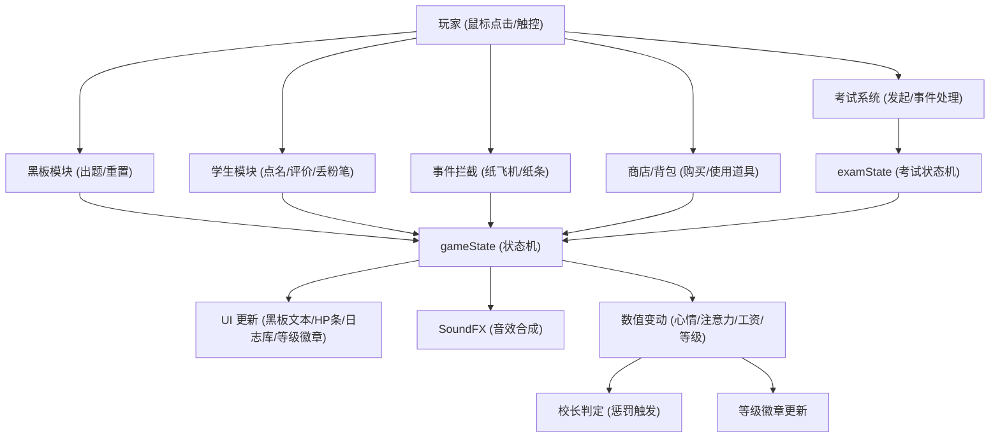

# 《我的课堂》项目系统审计报告 (Master.md)

本报告对《我的课堂》(My Class) 模拟教学游戏进行了全面的代码审计与系统化总结，旨在解析其技术架构、核心实现及交互逻辑。

---

## 一、 项目代码框架

项目采用纯原生技术栈开发，实现了高度动态的课堂模拟体验：
- **前端核心**：HTML5 + CSS3 + JavaScript (ES6+)
- **渲染模式**：DOM 驱动的组件化渲染，利用 CSS Grid/Flex 分层布局
- **音效系统**：基于 **Web Audio API** 的原生合成器，不依赖任何外部音频文件
- **状态管理**：集中式 `gameState` + `examState` 双状态机，驱动响应式 UI 更新
- **设备适配**：自动检测触控设备，实现 PC/移动端双端交互适配
- **数据持久化**：LocalStorage 存档系统，支持多存档管理

---

## 二、 系统架构图

```
┌─────────────────────────────────────────────────────────────────┐
│                        用户交互层 (UI Layer)                      │
├─────────────┬─────────────┬─────────────┬─────────────┬─────────┤
│  开始界面   │  游戏主界面  │  商店/背包  │  考试系统   │ 课间活动 │
│ StartScreen │ GameScreen  │ Shop/Invent │ ExamSystem  │ BreakTime│
└──────┬──────┴──────┬──────┴──────┬──────┴──────┬──────┴────┬────┘
       │             │             │             │           │
       ▼             ▼             ▼             ▼           ▼
┌─────────────────────────────────────────────────────────────────┐
│                      状态管理层 (State Layer)                     │
├─────────────────────────────┬───────────────────────────────────┤
│        gameState            │           examState               │
│  - teacherName/Gender       │  - isActive                       │
│  - salary (HP)              │  - timeRemaining                  │
│  - students[6]              │  - examResults                    │
│  - questionPhase            │  - currentEvent                   │
│  - isBreakTime              │  - eventStudentIndex              │
│  - inventory                │  - birdBonus                      │
│  - examHistory[]            │                                   │
└─────────────────────────────┴───────────────────────────────────┘
       │             │             │             │
       ▼             ▼             ▼             ▼
┌─────────────────────────────────────────────────────────────────┐
│                      核心逻辑层 (Logic Layer)                     │
├─────────────┬─────────────┬─────────────┬─────────────┬─────────┤
│  出题系统   │  学生AI系统  │  事件系统   │  考试系统   │ 商店系统 │
│ MathQuestion│ StudentAI   │ RandomEvent │ ExamLogic   │ ShopSys │
└──────┬──────┴──────┬──────┴──────┬──────┴──────┬──────┴────┬────┘
       │             │             │             │           │
       ▼             ▼             ▼             ▼           ▼
┌─────────────────────────────────────────────────────────────────┐
│                      基础设施层 (Foundation)                      │
├─────────────────────┬─────────────────────┬─────────────────────┤
│    SoundFX 音效     │   DOM 操作工具      │   LocalStorage      │
│   Web Audio API     │   动画/特效系统      │   存档管理          │
└─────────────────────┴─────────────────────┴─────────────────────┘
```

---

## 三、 核心功能模块详解

### 1. 人格化学生模型
每个学生拥有独特的属性数组，这些属性动态决定其 AI 行为：
- `accuracy` (正确率)：决定答题对错概率，范围 0-100
- `naughty` (淘气值)：决定课堂搞小动作（纸飞机/纸条）及课间打闹的频率
- `attention` (注意力)：显著影响举手概率；过低会进入"打瞌睡"状态
- `mood` (心情值)：反馈机制的核心，影响整体表现
- `tier` (等级标签)：实时反映学生表现等级（学霸/普通/学渣）

### 2. 动态数学题库
支持三年级水平的多维度出题：
- **四则运算**：加减法（含进退位）、乘除法（含表内与整除）
- **知识点**：单位换算（时间/质量/长度）、简单估算
- **应用题**：带有 A/B/C 选项的逻辑题，通过字符串匹配判定

### 3. 多分支判定系统
游戏不仅判定答案的正误，还判定老师（玩家）的指令对错，共有四种结局：
- **双重正确**：心情、正确率双升，触发爱心特效
- **正向纠错**：指出错误，注意力提升
- **误导全班**：学生错但老师判对，触发校长惩罚（扣工资），全班正确率下降
- **打击信心**：学生对但老师判错，心情暴跌，全班正确率下降

### 4. 回答正确概率计算公式
学生回答正确答案的概率计算公式：
```
正确概率 = 正确率 × 70% - 淘气值 × 20% + 注意力 × 20% + 心情值 × 20%
```
- 计算结果上限为 **90%**
- 权重分配：正确率(正向70%)、淘气值(负向20%)、注意力(正向20%)、心情值(正向20%)

### 5. 学生等级标签系统
实时显示学生表现等级，位于学生姓名前方：
- **学霸**：金色渐变徽章 (`#FFD700` → `#FFA500`)
- **普通**：蓝色渐变徽章 (`#90CAF9` → `#42A5F5`)
- **学渣**：红色渐变徽章 (`#EF9A9A` → `#E57373`)

等级动态更新逻辑：
```javascript
function updateStudentTiers() {
  const scoredStudents = gameState.students.map(s => 
    ({ student: s, score: s.accuracy + s.attention - s.naughty }));
  scoredStudents.sort((a, b) => b.score - a.score);
  scoredStudents.forEach((item, index) => {
    if (index === 0) item.student.tier = '学霸';
    else if (index === scoredStudents.length - 1) item.student.tier = '学渣';
    else item.student.tier = '普通';
  });
}
```

---

## 四、 期末考试系统 (新增)

### 1. 系统概述
期末考试系统是游戏的核心玩法之一，提供 30 秒限时考试体验，包含三种随机突发事件。

### 2. 核心状态管理
```javascript
const examState = {
  isActive: false,          // 考试是否进行中
  timeRemaining: 30,        // 剩余时间（秒）
  timerInterval: null,      // 计时器引用
  eventTimer: null,         // 事件调度器
  examResults: null,        // 考试结果对象
  currentEvent: null,       // 当前事件类型
  eventStudentIndex: null,  // 事件相关学生索引
  eventTimeout: null        // 事件超时计时器
};
```

### 3. 三大随机事件

| 事件类型 | 触发条件 | 玩家操作 | 成功奖励 | 失败惩罚 |
|:---:|:---|:---|:---|:---|
| 👀 作弊 | 随机学生 | 点击学生制止 | 记录 `caught=true` | 学生作弊成功，校长扣50工资 |
| 🐦 小鸟 | 教室飞行 | 点击驱赶 | 全班+5分 | 全班-5分 |
| 😭 没笔 | 随机学生 | 点击笔筒借笔 | 学生正常答题 | 该学生-10分 |

### 4. 考试分数计算公式
```javascript
let baseScore = accuracy × 0.7 - naughty × 0.2 + attention × 0.2 + mood × 0.2;
let finalScore = baseScore + randomInt(-10, 10) + birdBonus;
if (noPen) finalScore -= 10;
if (cheated && !caught) finalScore += 10;
finalScore = Math.max(0, Math.min(100, Math.round(finalScore)));
```

### 5. 考试历史记录
```javascript
gameState.examHistory = [
  {
    date: "2026/3/25 14:30:00",
    avgScore: 72,
    studentScores: [
      { name: "王小明", score: 85 },
      { name: "李小红", score: 78 },
      // ...
    ]
  }
];
// 保留最近3次考试记录
```

### 6. UI 组件
- **发起考试按钮**：位于黑板左上角，橙色渐变样式
- **考试成绩按钮**：位于发起考试按钮下方，绿色渐变样式
- **倒计时条**：绿→黄→红三阶段颜色变化，最后10秒红色闪烁
- **笔筒道具**：黑板左下角，点击借笔给学生
- **学生考试表情**：每个学生头顶显示 ✏️/👀/😭 等状态

---

## 五、 玩法机制

### 1. 课堂时间
- **核心流程**：点击黑板出题 → 粉笔逐字动画 → 学生概率举手 → 玩家点名 → 评判结算
- **随机博弈**：玩家需在高频的捣乱事件（纸飞机、传纸条）中通过"拦截"来维持课堂秩序
- **惩罚机制**：工资即血条。判定严重错误或未能及时制止乱象将触发"校长突击检查"，导致工资（HP）下降

### 2. 课间模式
- **自治系统**：学生从固定座位转变为基于 `requestAnimationFrame` 的物理边界漫游
- **随机事件**：包含黑板涂鸦、摔倒大哭、分享零食、吵架推搡等，需要玩家通过"点击交互"或"选择决策"来处理
- **恢复机制**：课间休息结束后，学生注意力+15，心情+10

### 3. 商店与背包系统
| 道具 | 价格 | 效果 |
|:---:|:---:|:---|
| 📢 超级大喇叭 | ¥500 | 全班注意力+2 |
| 📏 无敌戒尺 | ¥500 | 全班淘气值-2 |
| 📝 课后习题 | ¥500 | 全班正确率+2 |
| 🌸 无尽小红花 | ¥500 | 全班心情+2 |

### 4. 双端交互适配
- **PC端**：`mouseenter`/`mouseleave` 事件触发学生信息悬浮窗
- **移动端**：`click` 事件触发，点击空白区域关闭悬浮窗
- **设备检测**：`'ontouchstart' in window || navigator.maxTouchPoints > 0`

---

## 六、 动画设计与实现

### 1. 物理弹道动画
使用 **Web Animations API** (`element.animate`) 实现：
- **粉笔头**：非线性抛物线，中途缩放模拟真实飞行感
- **纸飞机**：带有弧度和旋转的复杂弹道
- **传纸条**：贝塞尔曲线飞行路径

### 2. 视觉反馈
- **粒子特效**：基于 CSS Keyframes 的爱心喷涌、粉红噪声震动
- **状态动画**：打瞌睡的 `Zzz` 文字漂移、语音气泡的渐入渐出
- **UI 动效**：黑板逐字写入效果、HP 条的动态色彩平滑过渡

### 3. 考试专属动画
- **倒计时条颜色过渡**：绿(30-20s) → 黄(20-10s) → 红闪烁(10-0s)
- **小鸟飞行动画**：6.5秒斜向穿越教室
- **事件脉冲动画**：学生头顶 emoji 放大缩小提示

### 4. 层级渲染系统
为确保动画效果完整展示，采用以下 z-index 分层策略：
| 层级 | z-index | 元素 |
|:---:|:---:|:---|
| 底层 | 1 | 学生图片、课桌 |
| 中层 | 100 | 学生状态图标、考试按钮 |
| 高层 | 200 | 对话气泡 |
| 特效层 | 9000 | 特效容器 |
| 顶层 | 10000 | 学生信息悬浮窗、考试弹窗 |

---

## 七、 操作逻辑与模块关系



---

## 八、 审计结论

项目通过精简的代码实现了极高的交互密度：
1. **轻量化**：完全自包含，零外部资源依赖（音频、库）
2. **逻辑严密**：判定分级与数值连锁反应增加了游戏的策略深度
3. **表现力强**：通过原生 API 模拟了丰富的物理与动态交互效果
4. **跨端适配**：自动检测设备类型，实现 PC/移动端无缝切换
5. **系统完整**：包含课堂、课间、考试、商店四大核心玩法循环

---

## 九、 开发迭代与需求跟踪

本章节记录了开发过程中由用户（开发者）发起的关键指令及 Bug 反馈的执行情况。

### 1. UI 深度优化需求
| 需求描述 | 执行状态 | 备注 |
| :--- | :---: | :--- |
| **黑板高度翻倍** | ✅ 已完成 | 增加了黑板 `min-height` 并优化了布局比例 |
| **移除讲台区域** | ✅ 已完成 | 移除了 `.podium-area` 结构，扩展了活动空间 |
| **底部工资栏转事件日志** | ✅ 已完成 | 实现了基于时间戳的滚动日志流系统 |
| **老师头顶 HP 血条** | ✅ 已完成 | 将工资数值具象化为动态变化的血条 UI |
| **评判面板去模糊** | ✅ 已完成 | 移除了背景 `backdrop-filter`，方便评卷校对 |
| **信息分流显示** | ✅ 已完成 | 黑板仅保留题目，判定与事件信息重定向至日志 |
| **答错循环优化** | ✅ 已完成 | 学生答错后保留题目并重新触发全班举手，直至答对 |
| **老师UI放大1.5倍** | ✅ 已完成 | 老师图片尺寸调整为 189×237px |
| **学生UI放大1.3倍** | ✅ 已完成 | 学生图片尺寸调整为 156×192px |
| **血条优化** | ✅ 已完成 | 移至粉笔槽下方、纯数字显示、20格游戏风格血条 |
| **学生左右间隔加大** | ✅ 已完成 | 学生间距优化 |
| **底部通知栏加高** | ✅ 已完成 | 高度调整为 100px，可显示3条以上通知 |
| **学生位置整体上移** | ✅ 已完成 | 调整 margin-top 和教师区域间距 |
| **学生名字叠放图片下方** | ✅ 已完成 | 名字添加渐变背景，叠放在图片底部区域 |
| **教室环境光影优化** | ✅ 已完成 | 墙壁/地板/黑板添加光影效果，增强空间感 |
| **响应式布局优化** | ✅ 已完成 | 桌面端大屏/小屏/移动端竖屏/横屏四档适配 |
| **移除墙壁装饰元素** | ✅ 已完成 | 移除窗户、时钟、国旗、横幅等装饰元素，简化界面 |
| **HP血条位置调整** | ✅ 已完成 | 移至黑板正下方，与黑板宽度对齐 |
| **教师区域位置调整** | ✅ 已完成 | 移至HP血条下方，优化垂直布局层次 |
| **信息窗宽度约束** | ✅ 已完成 | 底部信息栏宽度跟随父容器，实现自适应布局 |
| **学生等级徽章显示** | ✅ 已完成 | 在学生姓名前实时显示学霸/普通/学渣徽章 |

### 2. BUG 反馈与修复记录
| BUG 描述 | 修复状态 | 解决方案总结 |
| :--- | :---: | :--- |
| **HP 条只有文字无 UI** | ✅ 已修复 | 补全了 style.css 中缺失的 `.hp-track` 和 `.hp-fill` 样式 |
| **纸飞机数值动画丢失** | ✅ 已修复 | 恢复了 triggerPaperAirplane 中被意外删除的全员数值循环逻辑 |
| **黑板重复提示 (请点击...)** | ✅ 已修复 | 优化了 updateChalkboard 的过滤逻辑与状态锁 |
| **答对后黑板不自动清空** | ✅ 已修复 | 修正了 handleJudgment 的 `setTimeout` 闭合及状态重置逻辑 |
| **SoundFX.pa() 重复定义** | ✅ 已修复 | 移除了第一个定义，保留粉红噪声版本 |
| **小芳缺少 data-id 属性** | ✅ 已修复 | 为小芳添加 `data-id="xf"` 属性 |
| **课间时长注释与实际不符** | ✅ 已修复 | 常量 BREAK_DURATION_MS 更新为 30000 |
| **第二题后点击学生无反应** | ✅ 已修复 | 修正了 `.student-img img.active` 的 `pointer-events` 属性 |
| **第二排学生显示不全** | ✅ 已修复 | 调整学生区域布局和教师区域间距 |
| **悬浮窗无法正常消失** | ✅ 已修复 | 移除 `hideTooltip()` 中的 `setTimeout` 延迟 |
| **校长惩罚后无法继续答题** | ✅ 已修复 | 修正了校长动画 CSS 的 `visibility` 属性和 JS 清理逻辑 |
| **学生答对老师错判卡住** | ✅ 已修复 | 修正了校长惩罚特效中引用不存在元素的问题 |
| **学生信息悬浮窗被截断** | ✅ 已修复 | 将 `.student-tooltip` 改为 `position: fixed; z-index: 10000` |
| **随机事件动画被截断** | ✅ 已修复 | 将 `.classroom` 和 `.desks-area` 的 `overflow` 改为 `visible` |
| **考试按钮触发黑板点击** | ✅ 已修复 | 添加 `e.stopPropagation()` 阻止事件冒泡 |
| **考试期间点击黑板出题** | ✅ 已修复 | 黑板点击处理中检查 `examState.isActive` 状态 |
| **课间考试按钮未隐藏** | ✅ 已修复 | `enterBreakTime()` 中隐藏 `startExamBtn` |
| **成绩单确定按钮无响应** | ✅ 已修复 | 修正事件绑定和课间触发逻辑 |

### 3. 功能增强记录
| 功能描述 | 执行状态 | 实现细节 |
| :--- | :---: | :--- |
| **课间休息恢复机制** | ✅ 已完成 | 课间结束后学生注意力+15，心情+10，并推送日志通知 |
| **回答正确概率公式** | ✅ 已完成 | 实现综合概率计算公式，上限90% |
| **移动端触控适配** | ✅ 已完成 | 实现设备检测函数 `isTouchDevice()` |
| **全局点击关闭悬浮窗** | ✅ 已完成 | 添加 `initGlobalClickHandler()` 函数 |
| **学生等级实时更新** | ✅ 已完成 | 实现 `updateAllTierBadges()` 函数 |
| **期末考试系统** | ✅ 已完成 | 30秒限时考试，三种随机事件，分数计算 |
| **考试成绩历史** | ✅ 已完成 | 保留最近3次考试记录，支持查看班级/学生成绩 |
| **考试自动触发课间** | ✅ 已完成 | 考试结束后自动进入课间休息 |
| **飞鸟动画速度优化** | ✅ 已完成 | 动画时长从4秒调整为6.5秒 |
| **笔筒交互区域扩大** | ✅ 已完成 | 添加 `::before` 伪元素扩大点击区域 |

---

## 十、 关键代码实现

### 1. 设备检测与交互适配
```javascript
function isTouchDevice() {
  return 'ontouchstart' in window || navigator.maxTouchPoints > 0;
}

function initStudentInteraction() {
  const studentEls = document.querySelectorAll('.student');
  const isMobile = isTouchDevice();

  studentEls.forEach((student, index) => {
    if (isMobile) {
      student.addEventListener('click', handleMobileStudentClick);
    } else {
      student.addEventListener('mouseenter', () => showTooltip(student, gameState.students[index]));
      student.addEventListener('mouseleave', hideTooltip);
      student.addEventListener('click', handleDesktopStudentClick);
    }
  });
}
```

### 2. 考试事件调度系统
```javascript
function scheduleRandomEvent() {
  if (!examState.isActive) return;
  
  const delay = randomInt(5000, 15000);
  
  examState.eventTimer = setTimeout(() => {
    if (examState.isActive && !examState.currentEvent) {
      triggerRandomEvent();
    }
    scheduleRandomEvent();
  }, delay);
}

function triggerRandomEvent() {
  const events = ['cheat', 'bird', 'noPen'];
  const event = randomPick(events);
  
  switch (event) {
    case 'cheat': triggerCheatEvent(); break;
    case 'bird': triggerBirdEvent(); break;
    case 'noPen': triggerNoPenEvent(); break;
  }
}
```

### 3. 考试分数计算
```javascript
function calculateFinalScores() {
  examState.examResults.students.forEach(student => {
    const gameStudent = gameState.students[student.index];
    let baseScore = gameStudent.accuracy * 0.7 
                  - gameStudent.naughty * 0.2 
                  + gameStudent.attention * 0.2 
                  + gameStudent.mood * 0.2;
    
    let finalScore = baseScore + randomInt(-10, 10) + examState.examResults.birdBonus;
    
    if (student.noPen) finalScore -= 10;
    if (student.cheated && !student.caught) finalScore += 10;
    
    student.finalScore = Math.max(0, Math.min(100, Math.round(finalScore)));
  });
}
```

---

## 十一、 文件结构说明

```
d:\MyClass\
├── index.html          # 主页面结构 (391行)
├── style.css           # 全局样式与动画 (4033行)
├── game.js             # 核心游戏逻辑 (3490行, 153个函数)
├── Master.md           # 项目审计报告（本文件）
├── principal.png       # 校长惩罚图片
├── process_images.py   # 图片批处理脚本
├── vercel.json         # Vercel 部署配置
└── assets/
    └── characters/     # 角色图片资源 (21张PNG)
        ├── teacher_standing.png      # 男老师站立
        ├── teacher_F_standing.png    # 女老师站立
        ├── teacher_X_standing.png    # 青鸾老师站立
        ├── xm_*.png    # 小明 (sitting/raising/standing)
        ├── xh_*.png    # 小红
        ├── xf_*.png    # 小芳
        ├── xg_*.png    # 小刚
        ├── xl_*.png    # 小丽
        └── xq_*.png    # 小强
```

---

## 十二、 响应式断点设计

| 断点 | 屏幕类型 | 关键调整 |
|:---|:---|:---|
| `≥1920px` | PC 大屏 | 教室最大宽度900px，角色尺寸放大 |
| `≥900px` | 桌面端 | 完整布局，学生6人双排 |
| `700px-900px` | 小屏桌面 | 压缩间距，保持双排 |
| `500px-700px` | 移动端竖屏 | 单排布局，信息栏折叠 |
| `<500px` | 移动端小屏 | 极简布局，触控优化 |
| 横屏模式 | 移动端横屏 | 黑板与座位左右分布 |

---

## 十三、 近期重大变更说明

### 2026-03-25 期末考试系统上线
1. **新增功能**：
   - 30秒限时期末考试系统
   - 三种随机突发事件（作弊/小鸟/没笔）
   - 考试成绩单弹窗展示
   - 考试历史记录（保留最近3次）
   - 班级成绩/学生成绩排名查看

2. **UI 新增**：
   - 发起考试按钮（黑板左上角）
   - 考试成绩按钮（发起考试按钮下方）
   - 考试倒计时进度条（三色变化）
   - 笔筒道具（黑板左下角）
   - 学生考试表情指示器

3. **核心逻辑**：
   - 考试分数计算公式实现
   - 事件调度系统（5-15秒随机间隔）
   - 考试结束后自动触发课间休息

4. **Bug 修复**：
   - 考试按钮事件冒泡问题
   - 考试期间黑板点击冲突
   - 课间考试按钮显示问题
   - 成绩单确认按钮响应问题

---

*报告更新于：2026-03-25*

---

## 十四、 2026-03-25 代码审计修复记录

### 1. 关键 BUG 修复
| BUG 描述 | 修复状态 | 解决方案总结 |
| :--- | :---: | :--- |
| **`updateHpDisplay()` 函数未定义** | ✅ 已修复 | `handleCheatFailed()` 中调用了不存在的 `updateHpDisplay()`，替换为正确的 `updateSalaryDisplay()` |
| **存档遗漏 `examHistory` 字段** | ✅ 已修复 | `saveGame()` 中补充 `examHistory` 序列化，`handleLoadSave()` 中补充反序列化恢复 |
| **校长惩罚函数重复** | ✅ 已修复 | `triggerPrincipalPunish(message)` 与 `triggerPrincipalPunishment()` 行为不一致，统一考试版视觉效果（闪屏+探头+音效） |
| **工资可变为负数** | ✅ 已修复 | `triggerPrincipalPunishment()` 中 `salary -= 50` 添加 `Math.max(0, ...)` 下限保护 |
| **HTML 倒计时初始值不一致** | ✅ 已修复 | `index.html` 中 `examTimerText` 初始文本从 `60` 修正为 `30`，与 JS 常量 `EXAM_DURATION` 一致 |

### 2. 代码安全优化
| 优化项 | 执行状态 | 实现细节 |
| :--- | :---: | :--- |
| **`showSleepIcon()` innerHTML 替换** | ✅ 已完成 | 改用 `createElement` + `textContent` 构建 DOM，消除 XSS 向量 |
| **容器清空方式优化** | ✅ 已完成 | `savesList` 和 `inventoryItems` 的 `innerHTML = ''` 替换为 `replaceChildren()` |
| **Master.md 文件结构补全** | ✅ 已完成 | 补充 `process_images.py` 和 `vercel.json` 描述，更新行数统计 |
